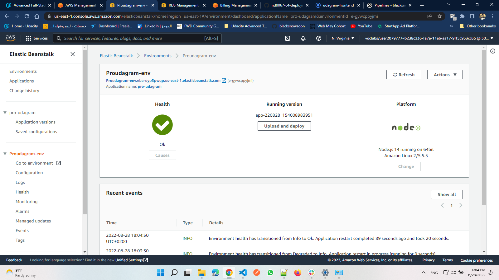
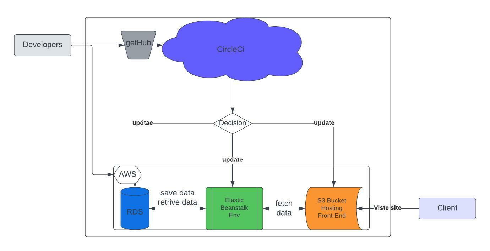
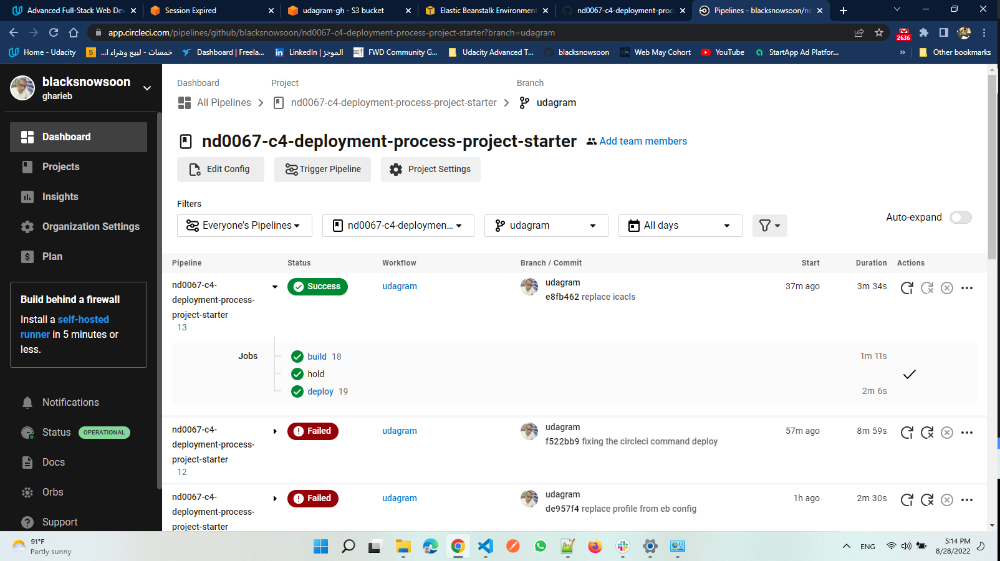

# Deploy Udagram app using AWS and Circle-CI

## RDS database
 Connecting the app to RDS 
 postgres database has been created and connected successfully to the app under the us-east-1 region for low cost.

 ## IAM 
  Identity Access Mangment has been created with in a policy of an admin group to reach the ressources of AWS programmatically

## Elastic Beanstalk
  An environment created with platform Node.js -V 14.15  to host the api (back-end) of the app and has health status OK
  you can visit it from here : back-end link
  http://Proudagram-env.eba-uyp3pwqp.us-east-1.elasticbeanstalk.com

  

## S3 Bucket
  A S3 bucket created to host a the front-end as static hosting and the Angular front-end There you can visit it from here : front-end link
  http://udagram-gh.s3-website-us-east-1.amazonaws.com
  
## Circle-Ci
  The App has pushed to GitHub repo and connected to Circle-ci with automated pipeline for deployment process the pipeline prepare the app environment needs as Node, AWS-CLI, Elastic Beanstalk, than intstall dependencies for the front-end, install dependencies for the api(back-end), lint and build the front-end, build the api and hold on for manual approve to complete the deploy process for both apps.

## Diagram for the Services and Process
  

## Screenshot for last build and deploy from the pipline
  